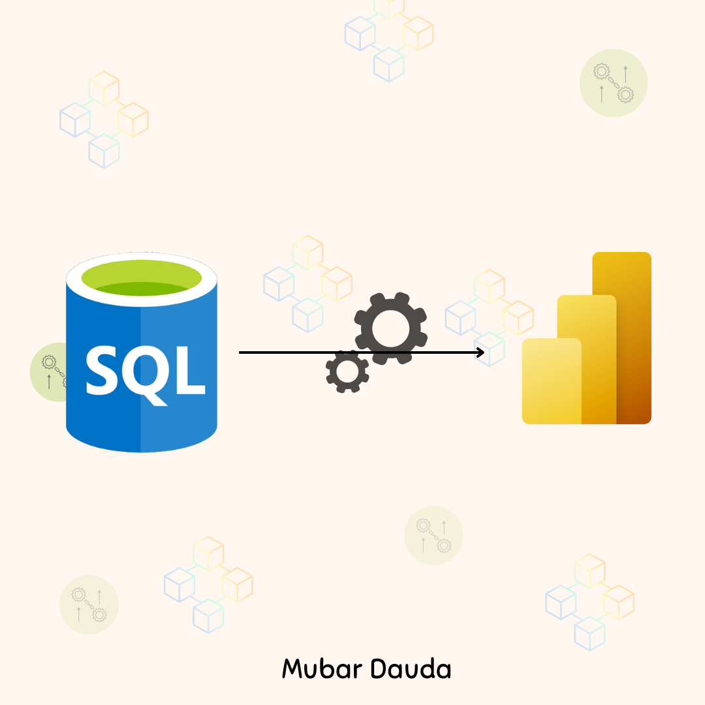

# Microsoft SSMS Database to Power BI Desktop & Service

## Contoso Retail: Competitive Sales Channel & Marketing Analysis

# Table of Content
- [Project Title](#Project-Title)
- [My Role](#My-Role)
- [Project Overview](#Project-overview)
- [Problem Statement](#Problem-statement)
- [Stakeholder Engagement](#Stakeholder-Engagement)
    - [Target Stakeholder](#Target-stakeholder)
    - [Use Cases](#Use-cases)
    - [Stakeholders Stories](#Stakeholder-stories)
    - [Acceptance Criteria](#Acceptance-criteria)
    - [Success Criteria](#Success-criteria)
- [Data Source](#Data-source)
  - [Dataase Structure](#Access-Database-Structure)
  - [Access Database Benefit](#Benefit-of-Access-Storage)
- [Methodology](#Methodology)
  - [Tool used](#Tool-Used)
  - [Development](#Development)
  - [ETL Process](#ETL-Process)
  - [Data Modelling](#Data-modelling)
  - [DAX Measure Created](#DAX-Measure-created)
  - [Analysis](#Analysis)
  - [Visualisation](#Visualisation)
  - [MOCK UP DASHBOARD](#Mukkup_design_Dashboard)
- [Detailed Insights and Recommendations](#Detailed-Insights-and-Recommendation)
  - [Dashboard 1](#Sales-Pulse-Performance,-Frequency-&-Return-(Executive-Overview))
  - [Dashboard 2](#Sales-Performance-&-Customer-Behaviour-(Net-sales-by-Customer-Demographic))
  - [Dashboard 3](#Product-portfolio-performance-(Based-on-Gross-Proft))
 
# Project Title:
Contoso Competitive Sales Channel Analysis

# My Role
Power BI Developer/Data Analyst  

  - Designed the relational data model in Power BI through direct query option to  Microsoft SQL Server Management Studio data sources.
  - Developed Power BI dashboard for executive decision-making marketing and sales channel strategy.
  - Created advanced DAX measures for sales, margin, and trend analysis
  - Conducted ETL and data cleansing with Power Query
  - Delievered insights into channel Profitability, product performance, and geographic sales behavior

# Project Overview  

This project analyses Contoso’s multi-channel retail operations (Store, Online, Reseller, Catalog) to uncover sales trends, profit margins, and geographic performance using a SQL-based backend. Interactive Power BI dashboards support executive-level decisions regarding marketing strategy, resource allocation, and inventory planning.

# Problem Statement

Contoso lacked clear visibility into how different sales channels, products, and regions performed over time.
Key business questions included:  

- Which sales channels drive the most revenue and profit?
- What are the most profitable product subcategories?
- How do sales and margins differ by region and time period?  

This project resolves these issues by delivering a suite of Power BI dashboards with intuitive visualizations and actionable metrics.

# Stakeholder Engagement
## Target Stakeholder

- Executives (Sales, Marketing, Finance)
- Regional Managers
- Channel Analysts
- Product Strategy Teams

# Use Cases

- Compare YoY channel performance
- Optimize product mix and catalog strategies
- Localize marketing based on regional sales behavior
- Evaluate channel-specific ROI and margin performance

# Stakeholder Stories

- "As a Channel Manager, I need to see which channels are underperforming YoY so I can act quickly."
- "As a Marketing Head, I want to know which products have the best margins in each region."
- "As an Executive, I need to see overall sales, profitability, and performance trends in one dashboard."

# Acceptance Criteria

- Clear display of KPIs: Overall and top 5 brand Total Sales, Profit Margin, YoY Changes
- Filters for year, region, channel
- Channel-level breakdowns of product performance and margin
- Geo-mapping and trend visuals
- channels Bookmark button to interchange insights visual chanel profit, trends of sales and profit margin and product subcategory breakdown.

# Success Criteria

- Senior stakeholders can make informed, strategic decisions
- Analysts gain self-service access to performance metrics
- Marketing campaigns are aligned with profitable regions/products
- Product teams reduce inventory waste through data-backed insights

# Data Source

### Microsoft SQL Server Management Studio (SSMS) Structure  

    ## Add a picture of each table and ERD diagram, but mainly picture of tables that was used.

- DimProductCategory Table: Including ProductCategoryDecription, ProductCategoryKey, ProductCategoryLabel, and ProductCategoryName.

- DimProductSubcategory Table: ProductCategoryKey, ProductSubcategoryDescrition, ProductSubcategoryKey, ProductSubcategoryLabel, and ProductSubcategoryName.

- DimProduct Table: AvailableForSaleDate, BrandName, ColorID, ColorName, Manufacturer, ProductDescription, ProductKey, ProductLabel, and ProductName.

- DimChannel: ChannelDescription, ChannelKey, ChannelLabel, ChannelName, LoadDate, and UpdateDate.

- FactSales Table: ChaneelKey, DateKey, DiscountAmount, DiscountQuantity, Gross Profit, Gross-Margin, Net Sales, ProductKey, Profit Margin, ReturnAmount, ReturnQauntity, Sales, SalesQuantity, StoreKey, Subcategory_Channel, TotalCost, UnitCost, and UnitPrice.

- DimGeography Table:  ContinentName, GeographyKey, Region-State/Province, RegionCountryName, StateProvinceName.

- Date Table: Date, FY-Month, FY-Quarters, FY-Year, Month, Month Name, Month-Short, Month-VSH, Period, Quarter, and Year.

- DimStore Table: AddressLine1, CloseDate, EmployeeCount, GeographyKey, Geolocation, Geometry, LastRemodelDate, OpenDate, Satus, StoreKey, StoreManager, StoreNmae, and Storetype.

### Benefit of Microsoft SSMS Storage.

