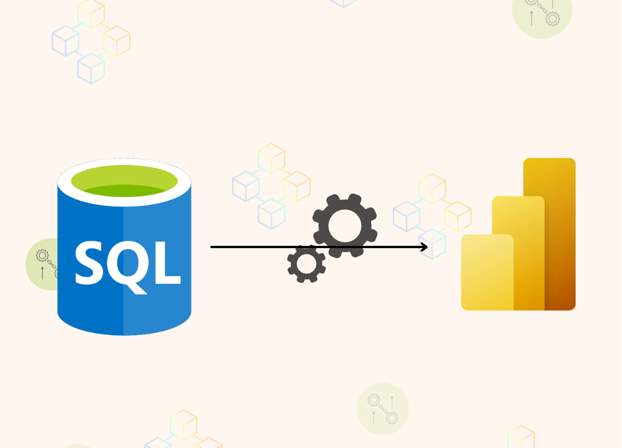

# Microsoft SSMS Database to Power BI Desktop & Service

## Contoso Retail: Competitive Sales Channel & Marketing Analysis

# Table of Content
- [Project Title](#Project-Title)
- [My Role](#My-Role)
- [Project Overview](#Project-overview)
- [Problem Statement](#Problem-statement)
- [Stakeholder Engagement](#Stakeholder-Engagement)
    - [Target Stakeholder](#Target-stakeholder)
    - [Use Cases](#Use-cases)
    - [Stakeholders Stories](#Stakeholder-stories)
    - [Acceptance Criteria](#Acceptance-criteria)
    - [Success Criteria](#Success-criteria)
- [Data Source](#Data-source)
  - [Dataase Structure](#Access-Database-Structure)
  - [Access Database Benefit](#Benefit-of-Access-Storage)
- [Methodology](#Methodology)
  - [Tool used](#Tool-Used)
  - [Development](#Development)
  - [ETL Process](#ETL-Process)
  - [Data Modelling](#Data-modelling)
  - [DAX Measure Created](#DAX-Measure-created)
  - [Analysis](#Analysis)
  - [Visualisation](#Visualisation)
  - [MOCK UP DASHBOARD](#Mukkup_design_Dashboard)
- [Detailed Insights and Recommendations](#Detailed-Insights-and-Recommendation)
  - [Dashboard 1](#Sales-Pulse-Performance,-Frequency-&-Return-(Executive-Overview))
  - [Dashboard 2](#Sales-Performance-&-Customer-Behaviour-(Net-sales-by-Customer-Demographic))
  - [Dashboard 3](#Product-portfolio-performance-(Based-on-Gross-Proft))
 
# Project Title:
Contoso Competitive Sales Channel Analysis

# My Role
Power BI Developer/Data Analyst  

  - Designed the relational data model in Power BI through direct query option to  Microsoft SQL Server Management Studio data sources.
  - Developed Power BI dashboard for executive decision-making marketing and sales channel strategy.
  - Created advanced DAX measures for sales, margin, and trend analysis
  - Conducted ETL and data cleansing with Power Query
  - Delievered insights into channel Profitability, product performance, and geographic sales behavior

# Project Overview  

This project analyses Contoso’s multi-channel retail operations (Store, Online, Reseller, Catalog) to uncover sales trends, profit margins, and geographic performance using a SQL-based backend. Interactive Power BI dashboards support executive-level decisions regarding marketing strategy, resource allocation, and inventory planning.

# Problem Statement

Contoso lacked clear visibility into how different sales channels, products, and regions performed over time.
Key business questions included:  

- Which sales channels drive the most revenue and profit?
- What are the most profitable product subcategories?
- How do sales and margins differ by region and time period?  

This project resolves these issues by delivering a suite of Power BI dashboards with intuitive visualizations and actionable metrics.

# Stakeholder Engagement
## Target Stakeholder

- Executives (Sales, Marketing, Finance)
- Regional Managers
- Channel Analysts
- Product Strategy Teams

# Use Cases

- Compare YoY channel performance
- Optimize product mix and catalog strategies
- Localize marketing based on regional sales behavior
- Evaluate channel-specific ROI and margin performance

# Stakeholder Stories

- "As a Channel Manager, I need to see which channels are underperforming YoY so I can act quickly."
- "As a Marketing Head, I want to know which products have the best margins in each region."
- "As an Executive, I need to see overall sales, profitability, and performance trends in one dashboard."

# Acceptance Criteria

- Clear display of KPIs: Overall and top 5 brand Total Sales, Profit Margin, YoY Changes
- Filters for year, region, channel
- Channel-level breakdowns of product performance and margin
- Geo-mapping and trend visuals
- channels Bookmark button to interchange insights visual chanel profit, trends of sales and profit margin and product subcategory breakdown.

# Success Criteria

- Senior stakeholders can make informed, strategic decisions
- Analysts gain self-service access to performance metrics
- Marketing campaigns are aligned with profitable regions/products
- Product teams reduce inventory waste through data-backed insights

# Data Source

### Microsoft SQL Server Management Studio (SSMS) Structure  

    ## Add a picture of each table and ERD diagram, but mainly picture of tables that was used.

#### Fact Table
- FactSales Table: ChaneelKey, DateKey, DiscountAmount, DiscountQuantity, Gross Profit, Gross-Margin, Net Sales, ProductKey, Profit Margin, ReturnAmount, ReturnQauntity, Sales, SalesQuantity, StoreKey, Subcategory_Channel, TotalCost, UnitCost, and UnitPrice.  

| Column Name | Data Type | Description |
| --- | --- | --- |
| SalesKey | Whole Number | Unique Identifier of each sales |
| DateKey | Date | Date of each sales |
| ChannelKey | Whole Number | Foreign key referencing channel table (ChannelKey) |
| StoreKey | Whole Number | (Delete) not needed |
| SalesKey | Whole Number | Unique Identifier of each sales |
| DateKey | Date | Date of each sales |
| ChannelKey | Whole Number | Foreign key referencing channel table (ChannelKey) |
| ProductKey | Whole Number | Forforeign key referencing product table (Productkey) |
| SalesKey | Whole Number | Unique Identifier of each sales |
| DateKey | Date | Date of each sales |
| ChannelKey | Whole Number | Foreign key referencing channel table (ChannelKey) |
| UnitCost | Fixed decimal number | Cost per product sold |
| UnitPrice | Fixed decimal number | unit price per product sold |
| SalesQuantity | Whole Number | qauntity of product sold |
| ReturnedQuantity | Whole Number | Quantity of product sold amount returned |
| ReturnedQuantity | Fixed decimal number | Returned Sold Amount |
| DiscountQuantity | Whole Number | qauntity of product that is being discounted |
| DiscountAmount | Fixed decimal number | amount on discounted qauntity |
| TotalCost | Fixed decimal number | cost of goods sold |
| Sales | fixed decimal number | products qauntity sales |
| Gross_Margin | Fixed decimal number | Difference between sales and total cost amount | 

#### Dimension Tables

- DimProductCategory Table: Including ProductCategoryDecription, ProductCategoryKey, ProductCategoryLabel, and ProductCategoryName.  

| Column Name | Data Type | Description |
| --- | --- | --- |
| ProductCategoryKey | Whole Number | Unique identifier for each Product Category |
| ProductCategoryLabel | Text | Deletd |
| ProductCategoryName | Text | Name of each product category |
| ProductCategoryDescription | Text | short note to decribe each product category |  

- DimProductSubcategory Table: ProductCategoryKey, ProductSubcategoryDescrition, ProductSubcategoryKey, ProductSubcategoryLabel, and ProductSubcategoryName.  

| Column Name | Data Type | Description |
| --- | --- | --- |
| ProductSubCategoryKey | Whole Number | Unique identifier for each Product Subcategory |
| ProductSubCategoryName | Text | Name of each product subcategory |
| ProductSubCategoryDescription | Text | short note to describe the product subCategory |
| ProductCategoryKey | Whole Number | Foreign key referencing  product category table (ProductCategoryKey) |  

- DimProduct Table: AvailableForSaleDate, BrandName, ColorID, ColorName, Manufacturer, ProductDescription, ProductKey, ProductLabel, and ProductName.  

| Column Name | Data Type | Description |
| --- | --- | --- |
| ProductKey | Whole Number | Unique identifier for each product |
| ProductLabel | Text | (Delete) not needed in this analysis |
| ProductName | Text | Name of selling product |
| ProductDescrition | Text | short note of product description |
| ProductSubcategory | Whole Number | Foreign key referencing product Product Subcategory (ProductSubcategoryKey) |
| Manufacturer | Text | Manufacturer of contoso products |
| BrandName | Text | products brand name |
| ColorID | Text | (Delete) not needed |
| ColorName | Text | (Delete) not needed |
| StockTypeID | Whole Number | (Delete) not needed |
| StockTypeNmae | Text | (Delete) not needed |
| UnitCost | Fixed decimal number | Cost per product sold |
| UnitPrice | Fixed decimal number | unit price per product sold |
| AvailableForSaleDate | Date/Time | (Delete) Date when product would be available for sale |
| StopSaleDate | (Delete) Date/Time | Date when product is stopped being sold |
| Status | Text | (Delete) not needed |  

- DimChannel: ChannelDescription, ChannelKey, ChannelLabel, ChannelName, LoadDate, and UpdateDate.  

| Column Name | Data Type | Description |
| --- | --- | --- |
| Channelkey | Whole Number | Unique Identifier of each channel |
| ChannelLabel | Text | (Delete) not needed |
| ChannelName | Text | name of each Sales channel |
| ChannelDescription | Text | short note to explain channel further  |
| LoadDate | Date/Time | (delete) not needed |
| UpdateDate | Date/Time | (delete) not needed |  

- DimGeography Table:  ContinentName, GeographyKey, Region-State/Province, RegionCountryName, StateProvinceName.  

| Column Name | Data Type | Description |
| --- | --- | --- |
| GeographyKey | Whole number | Unique identifier to DimGeopgraphy |
| ContinentName | Text | Continent of each customers |
| SateProvinceName | Text | store or customer Continent Name |
| RegionCountryName | Text | store or customer countryname |  

- DimStore Table: AddressLine1, CloseDate, EmployeeCount, GeographyKey, Geolocation, Geometry, LastRemodelDate, OpenDate, Satus, StoreKey, StoreManager, StoreNmae, and Storetype.  

| Column Name | Data Type | Description |
| --- | --- | --- |
| StoreKey | Whole Number | Unique Key Identifier of each store  |
| GeographyKey | Whole Number | Foreign Key referencing the Geograpgy table (GeographyKey)  |
| StoreManger | Whole Number | this a number that is attached to each manager |
| StoreType | Text | Available store type used for sales of goods  |
| StoreName | Text | Name of each store |
| Status | Text | This indicate if the store is still active or shutdown |
| OpenDate | Date/Time | Date the store will shutdown from dervices |
| ColseDate | Date/Time | Date the store was close for services |
| AdressLine1 | Text | Address to the sotres |
| EmployeeCount | Whole Number | Total number of employee for each store |
| GeoLocation | Text | Longitude and Latitude point of each store Location |
| Geometery | Text | longitude or latitude point of each store location |  

This table is not needed for now but for future purpose is would be needed so in that case while cleaning transforming data, the table would not be loaded in the report pane.  

#### Time Intelligence Date Table
- Date Table: Date, FY-Month, FY-Quarters, FY-Year, Month, Month Name, Month-Short, Month-VSH, Period, Quarter, and Year.  

| Column Name | Data Type | Description |
| --- | --- | --- |
| Date | Date | Full date of day/Month/Year and a unique identifier  |
| Year | Whole Number | Calendar year |
| Month | Whole Number | month number of calendar year |
| Month Name | Text | Month name of calendar name |
| Quarter | Whole Number | Quarter of calendar year |
| Month Short | Text | Uses the first three character of each month |
| Period |  Text | Combination of year and month of the year |
| FY - Month | Whole Number | Fiscal year month  |
| FY - Year | Whole Number | Fiscal year |
| FY - Quarter | Whole Number |  Fiscal year quarter |  

### Benefit of Microsoft SSMS Storage.

# Methodology
### Tools Used
- Microsoft SSMS
- Power BI Desktop
- Power Query
- DAX

  ### Development

  - Connected SQL database sources to Power BI
  - 
  - Performed ETL with Power Query (Using direct Query)
  - Cleaned  and joined tables using keys
  - Built star schema with proper cardinality
  - Created a Data table for time intelligence
  - Developed DAX KPI's (Revenue, Margin, Growth, etc.)

  ### ETL Process

  - Extract: Pulled data from SQL Server
  - Transformed: Renamed, cleaned, joined, added calculated fields (e.g ROI, nET Sales)
  - Load: Loaded into Power BI with schema integrity.
 

### Data Modelling 

- Star schema with FactSales at the center
- Dim tables joined via surrogate keys
- One-to-many relationships maintained
- Calendar table used for slicing and trends
  
### DAX Measures Created

- Total Sales = SUM(FactSales[SalesAmount])
- Gross Profit = SUM(FactSales[GrossProfit])
- Profit Margin = DIVIDE([Gross Profit], [Total Sales])
- Net Sales = [Total Sales] - SUM(FactSales[ReturnAmount])
- YoY Sales = [Total Sales CY] - [Total Sales PY]
- ROI = DIVIDE([Gross Profit], SUM(FactSales[DiscountAmount]))

### Analysis  

- Channel performance analysis (e.g., Online vs Reseller)
- Profit Margin trends by product subcategory and region
- YoY changes to evaluate performance trajectory
- Customer geography impact on sales volumes
- Seasonal patterns in Catalog profitability

### Visualization

- KPI Cards (Total Sales, YoY Change, Channel Sales)
- Donut & Bar Charts (Sales by Channel, Product)
- Geo Maps (Sales by Country & Region)
- Line Charts (Sales & Profit over Time)
- Tree Maps (Brand-wise Sales Split)

